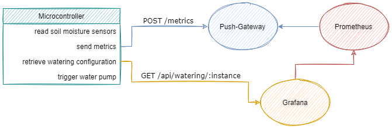
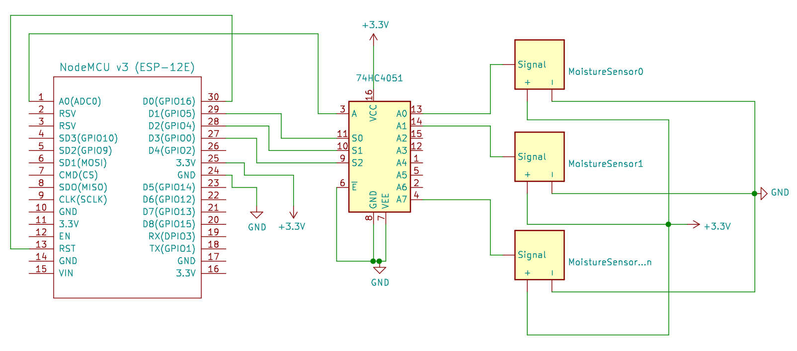

<br />
<p align="center">
  
  <!-- logomakr.com/1kEr6C# && picsvg.com -->

  <h3 align="center">Plants Care</h3>

  <p align="center">
    <a href="https://github.com/deuzu/plants-care/issues">Report Bug</a>
    ·
    <a href="https://github.com/deuzu/plants-care/issues">Request Feature</a>
    ·
    <a href="https://github.com/deuzu/plants-care/pulls">Send a Pull Request</a>
  </p>
</p>

## Table of Contents

* [About the Project](#about-the-project)
* [Getting Started](#getting-started)
* [Roadmap](#roadmap)
* [Contributing](#contributing)
* [License](#license)

## About the Project

Plants Care is a system that automatically takes care of plants.  
It controls soils moisture and trigger watering based on configured rules.  

### Built With

- [Arduino](https://www.arduino.cc/)
- [NodeJS](https://nodejs.org/en/) & [TypeScript](https://www.typescriptlang.org/)

## Getting Started



<!-- edit diagram: https://viewer.diagrams.net/?tags=%7B%7D&highlight=0000ff&edit=_blank&layers=1&nav=1#R7VltU6M6FP41%2FegdCKWlH9uq3Z2xu469c92931IIkDUQNoS%2B%2BOvvSQkFCtaqWHfu6DhKTk5Ccp7nJE9Cz5pGm5nASTjnHmE9ZHibnnXZQwgZAwT%2FlGWbW0wTWbklENTTttKwoI9EGw1tzahH0pqj5JxJmtSNLo9j4sqaDQvB13U3n7P6WxMckIZh4WLWtN5TT4baOjCMsuILoUGoXz0qKpbYfQgEz2L9vh6y%2FN1PXh3hoi%2Ftn4bY4%2BuKybrqWVPBucyfos2UMBXcImx5u%2BsnavfjFiSWpzSg4%2FlsPP8iNtesb9zhn5v7X%2BMLU4O1wizTAZlTV3CIthScMSL04OW2CFi6phHDMZQmPngtdI0BZTekzLvBW56pEaUSIlSUJiEX9BH8MYMqEwxQLaTmAxqo3ihjU8642L3HWlreyBvVWi5Uj%2FpdgqTQ9raYvnlgmuNNzfEGp7IYJcwLJyld7satGkZYBDSecCl5pJ1SmP4DqQzHxI7neHqYxaRD7IaZUKFIH4h0Q91fExqN1ooISTYVk4ZqRnhEpNiCi651NGv2adXPy%2BuSo6hgYlihp2lpI9Z5Eey7LrkBD5oeL6FKv0EVQbCnyMGpah1xmkoVDbCQOOUibXAHJi8bwY15TqYK%2FNqEGQ1iKIp8fhMVPgqpO9Z2yRPVW4JdGgc3xFcx6JeWOx0WZeLQ1me7%2FAup55FYMYNLLPFyT9%2BE01juwmZP4BcCOTX%2Bsns2jHwKZbMsw69yF3LKY5gMpjucCXBsTVL5PB2O5%2BLzJNGsgLQ5iRSFX%2FecsBucAOgVJ1T%2F1P1kwDszwEbnY8A0mU6ksaHjMLkI7xZLfPn120WTAEIhT1ZqGVhjSQTAkG%2FfPg0ygSXl8Scr3pcVQ%2BeDWTFosAI4EQRKTeSkUPPOouSTCO9LBNM4UTa8GxNM1MCYeCDAdREiFPKAx5hdldbJTlUTT0e99LnhCs9dyH4RKbdaPeJMcqUTZVRoS4ij2P5Q7QEOXfxZrbss1GFe2haqr4rKgR71HZe4bps0XDp23zaO6b6UZ8Ilx8KkTz4gRIk84qcZoEJ4FH9BGKy0q%2FoZp3twG2neQwOm6O3RFTwG6hEOjj6OcVEDL6pUNsnBGJz8FAnWIZVkAYmqatZw%2BqxDfIiOTwbt6HjD0dJogNuBRLdRXaMjy24km4laks3pQKK34oFOweM2S8OLGSzCa7ztGpRj%2BeNh4vitCA1chyz9bkDpWwcHJ%2BOMoDA%2FDe7ZvwkzrfH3x0vI%2Ba%2FLIknOuwB2GPtn1y7rxLUL%2FVFrV%2FPi41aorkOSNU8tnSTAWzaQ0xNggD4wAVoj7XysAqju%2FxU58AoF0FUWHT1Knz%2BNdk3HQqjtYO%2BgpW7Z860ylDSzjAOaDUdVojzv37cPiJWPoKTZfipv0CfW%2F4V6J8ib1y%2FgpzLP%2FCOZhwz7RcxDfeOov%2F1W%2F%2BE5mN28jC20nLqUhxofa8wHvzP1iWHyDxFersO1YS8Ivy%2F%2B7qkd4Xp%2FabdXhXlnT8hCfVivbn8vPLe7wFUiWg7uERzB2VP7bT1Du5b1luHUV6pis6xuoGbLBtrFzXs72M1LtleDPbvSWOOEwt%2Fyhg4GOKZxKnEMXX0SoJrQLd9eTGfYCQGgWH4BzBeH8jurdfUf -->

### Hardware Setup

- NodeMCU Lol1n v3 ESP8266 (ESP-12E) Wi-FI CH340: [Documentation](https://www.instructables.com/Getting-Started-With-ESP8266LiLon-NodeMCU-V3Flashi/)
- Analog multiplexer 74HC4051_8-Mux: [Data sheet](https://assets.nexperia.com/documents/data-sheet/74HC_HCT4051.pdf)
- Soil moisture sensor: Funduino [Data sheet](https://www.emartee.com/Attachment.php?name=42241.pdf)
- Water pump: to do
- Battery: [LiFePO4 18650](https://www.all-batteries.fr/accus-lithium-fer-phosphate-ifr18650-lifepo4-3-2v-1-8ah-ft-acl9073.html)



#### Arduino

1. Rename [./arduino/Secrets.h.dist](./arduino/PlantsCare/Secrets.h.dist) to `./arduino/Secrets.h` and replace its values.

```c++
#define PUSH_GATEWAY_BASEURL "https://ip:5091/metrics/job/plantcare/instance/a"
#define PLANTS_CARE_BASEURL "https://ip:5080/api/watering/a"
```

`a` at the end of the URLs represent a microcontroller, name it as you want.  
You can install how many microcontroller as needed.  

2. Compile & Upload (see [Makefile](./arduino/Makefile))
3. Bury soil moisture sensors in plants
4. Plug a battery
5. ???
6. Profit!

#### Box, Connectics & PCB

To do

### Software Setup

*Using Docker-Compose*

*docker-compose.yaml*
```yaml
services:
  plants-care-api:
    image: deuzu/plants-care-api:alpha
    restart: unless-stopped
    environment:
      DATABASE_HOST: plants-care-database
      DATABASE_NAME: ${DATABASE_NAME}
      DATABASE_USER: ${DATABASE_USER}
      DATABASE_PASSWORD: ${DATABASE_PASSWORD}
      DATABASE_CONNECTION_TIMEOUT: ${DATABASE_CONNECTION_TIMEOUT}
      DATABASE_CONNECTION_LIMIT: ${DATABASE_CONNECTION_LIMIT}
    ports:
      - 5080:80

  plants-care-database:
    image: mariadb
    restart: unless-stopped
    environment:
      MARIADB_RANDOM_ROOT_PASSWORD: 1
      MARIADB_DATABASE: ${DATABASE_NAME}
      MARIADB_USER: ${DATABASE_USER}
      MARIADB_PASSWORD: ${DATABASE_PASSWORD}
    volumes:
      - plants-care-database:/var/lib/mysql
      - ./database-init.sql:/docker-entrypoint-initdb.d/1-database-init.sql

  prometheus:
    image: prom/prometheus
    volumes:
      - ./prometheus.yaml:/etc/prometheus/prometheus.yml
      - prometheus:/prometheus
    ports:
      - 5090:9090

  push-gateway:
    image: prom/pushgateway
    volumes:
      - pushgateway:/data
    ports:
      - 5091:9091

  grafana:
    image: grafana/grafana
    volumes:
      - grafana:/var/lib/grafana
    ports:
      - 5030:3000
      
volumes:
  plants-care-database: ~
  prometheus: ~
  pushgateway: ~
  grafana: ~
```

*prometheus.yaml*
```yaml
global:
  scrape_interval: 30s
  evaluation_interval: 30s

rule_files: ~

scrape_configs:
  - job_name: prometheus
    static_configs:
      - targets: [localhost:9090]

  - job_name: push-gateway
    static_configs:
      - targets: [push-gateway:9091]
    honor_labels: true
```

Consider using a reverse proxy like [nginx-proxy/nginx-proxy](https://github.com/nginx-proxy/nginx-proxy) or [traefik/traefik](https://github.com/traefik/traefik).

## Roadmap

- [ ] How to waterproof moisture sensor? Silicon?
- [ ] [Power consumption savings](https://diyi0t.com/how-to-reduce-the-esp8266-power-consumption/) with [deep sleep](https://randomnerdtutorials.com/esp8266-deep-sleep-with-arduino-ide/): [gist examples](https://github.com/thingforward/esp8266-deep-sleep-examples)
- [ ] Handle HTTPS properly
- [ ] automatic watering [e.g.](https://how2electronics.com/iot-smart-agriculture-automatic-irrigation-system-with-esp8266/)
- [ ] PCB [how to](https://riton-duino.blogspot.com/2018/11/concevoir-un-pcb.html) & [Phil's lab youtube channel](https://www.youtube.com/channel/UCVryWqJ4cSlbTSETBHpBUWw)
- [ ] Box and connectics
- [ ] Solar panels
- [ ] [Rewrite it in Rust](https://blog.cecton.com/posts/rust-and-arduino-part1/) + [Tonari examle](https://blog.tonari.no/rust-simple-hardware-project)

## Contributing

Contributions are what make the open source community such an amazing place to be learn, inspire, and create. Any contributions you make are **extremely appreciated**.  
Please read [those guidelines](./.github/CONTRIBUTING.md) before contributing to this repository.

1. Fork the Project
2. Create your Feature Branch (`git checkout -b feat-amazing-feature`)
3. Commit your Changes (`git commit -m 'feat(scope): Add some AmazingFeature' -m "Closes #42"`)
4. Push to the Branch (`git push origin feat-amazing-feature`)
5. Open a Pull Request

### Development

#### Arduino

`cd arduino & make`

[Arduino CLI](https://arduino.github.io/arduino-cli/getting-started/)

To find the board:
```console
arduino-cli board list
```

If error "Could not open serial port /dev/ttyUSB0" is encountered:
```console
sudo usermod -a -G dialout <username>
# or
sudo adduser <username> dialout
```

Example soil moisture level sent:

```console
cat <<EOF | curl --data-binary @- localhost:5092/metrics/job/plantcare/instance/a
# HELP moisture level in percentage
# TYPE moisture_level gauge
moisture_level{sensor="0"} 12
moisture_level{sensor="1"} 74.605713
moisture_level{sensor="2"} 42
moisture_level{sensor="3"} 654
EOF
```

#### API

`cd api && make`

## License

[MIT](./LICENSE)
