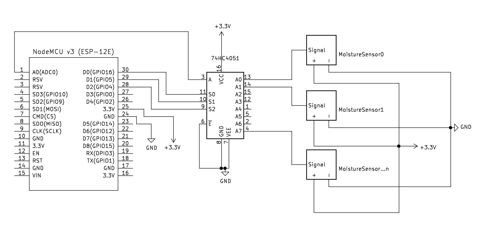
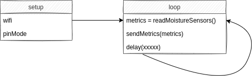

# Plants Monitoring

## Moisture level

### Modules

- NodeMCU Lol1n v3 ESP8266 (ESP-12E) Wi-FI CH340: [Documentation](https://www.instructables.com/Getting-Started-With-ESP8266LiLon-NodeMCU-V3Flashi/)
- Analog multiplexer 74HC4051_8-Mux: [Data sheet](https://assets.nexperia.com/documents/data-sheet/74HC_HCT4051.pdf)
- Soil moisture sensor: Funduino [Data sheet](https://www.emartee.com/Attachment.php?name=42241.pdf)

### Schematic



### Box, Connectics & PCB

To do

### Code



<!-- edit diagram - https://viewer.diagrams.net/?highlight=0000ff&edit=_blank&layers=1&nav=1#R7VhLb6MwEP41kbqHjXhDj0n6OjRS1Ry6PbrggLcGI%2BM00F%2B%2FY7ADhKRNu%2BlWq5ZGKjOeGXv8fWMbj%2BxZWl5ylCdzFmE6soyoHNlnI8sybdeAf1JTNRrfcxpFzEmkjFrFgjxjpVR%2B8YpEuOgZCsaoIHlfGbIsw6Ho6RDnbN03WzLa7zVHMR4oFiGiQ%2B0diUSitJ5htA1XmMSJ6vpUN6RIGytFkaCIrTsq%2B3xkzzhjonlLyxmmcvL0vDR%2BF3taNwPjOBOHOJDJ%2FHIyv%2BLlBXWMW3Rf3v2e%2FPSbKE%2BIrlTCBRarXI1YVHoaijVJKcpAmi5ZJhaqxQA5TAiNrlHFVnIYhUDho5amCePkGewRhSYTFNDMhULZ8mQ0QumMUcbrfuylK%2F96ngsZUfXFcQG%2BNzpnc0s1R2XP8BoVQo%2BSUYrygjzU45aOKeIxyaZMCJYqo0Jw9og7w%2FHqRyXd0TeP9HjEIkxURDWXmAtc7gXJ3EAPNYNZigWvwEQ5OIosVV9cd6indUmHdX6gGK%2FYHm8Ct4SAF8WJN%2FAjGPBjTZZkQA9IWAzmL2MNXzoIKxWiJM5ApHgp3eSMESi5iVILlstgOQpJFl%2FXNmdOq7lVeUsVA98lrcsqIVGEM4k9E0ighw1Bc0YyUU%2BMO4UfTN%2FMGLsjFwY%2BA9lsZfhJcw5QZ5ALIjVoGFi0xoV4F9z7q27IAQU61MVBoGu7o4N%2BOgA9J5lc2r9x%2F0jcXeuTcTftAfCUsS%2B7GXQxf%2FvOIHPRM5OgMFlxfJwtwgpe3SMsYwdtTMP5KN44A97IwCQsQFnLBscomjNSCJiGBc4KxouTH192OXn%2FCtKU6Fu2jp1c%2BLglxN1xoMyieUOHE0WLb%2BSPjvyOzeMfI%2B8NkIdvQVSdlPL5RvzoiOsz%2F%2BchPvx4HKAcrvgTjtQmCgvBRH6SgxhSVBQklHu7SPV5AJdE%2FJIIjM3AU%2FK9bBsbdqDkM72p10LVEW4wJ5AY5lqXQZK%2FNl2DcF%2FHdrXYhqolHavJAUeDe4GD4ILs2YqH%2BIBKgdNPjF%2BM6OwmQAdxdwfgWseh%2FAR56qexiwWqhxtJ%2BvacYZ72zxm2vsjQIZpElVf34mE7kGP3A5324zTzMIgDVEFVx0zV5N7xbq6MVDdmYLw4LMvv23s9c3hpBtDWxwaBvyiZ4ff0oGRerRLNa%2BPovDYPZHDwfxB466BsWlvEO5TAMKCxbxqeH5iwMLmO7%2FXi%2Bofx%2BXUOgdheBzbm7aWqff4H -->

Example of sent metrics of plants moisture level:

```console
cat <<EOF | curl --data-binary @- localhost:5092/metrics/job/plantcare/instance/a
# HELP moisture level in percentage
# TYPE moisture_level gauge
moisture_level{sensor="0"} 12
moisture_level{sensor="1"} 74.605713
moisture_level{sensor="2"} 42
EOF
```

[Arduino CLI](https://arduino.github.io/arduino-cli/getting-started/)

```
arduino-cli core update-index
arduino-cli core install esp8266:esp8266
arduino-cli board list
arduino-cli compile --fqbn esp8266:esp8266:nodemcuv2 MoistureLevel && \
arduino-cli upload -p /dev/ttyUSB0 --fqbn esp8266:esp8266:nodemcuv2 MoistureLevel && \
stty -F /dev/ttyUSB0 raw 9600 && \
cat /dev/ttyUSB0
```

### To do

- [ ] Moisture sensor signal ouput voltage can be up to 1.7v, Analog0 tolerate up to 1v. Is a resistor needed?
- [ ] Battery [LiFePO4 18650](https://www.all-batteries.fr/accus-lithium-fer-phosphate-ifr18650-lifepo4-3-2v-1-8ah-ft-acl9073.html)
- [ ] [Power consumption savings](https://diyi0t.com/how-to-reduce-the-esp8266-power-consumption/) with [deep sleep](https://randomnerdtutorials.com/esp8266-deep-sleep-with-arduino-ide/): [gist examples](https://github.com/thingforward/esp8266-deep-sleep-examples)
- [ ] PCB [how to](https://riton-duino.blogspot.com/2018/11/concevoir-un-pcb.html)
- [ ] Box and connectics
- [ ] Solar panels
- [x] Schemas
- [x] [arduino-cli](https://github.com/brendandburns/arduino-air-quality-exporter/blob/master/arduino-cli.yaml)
- [x] [example post request](https://randomnerdtutorials.com/esp8266-nodemcu-http-get-post-arduino/#http-post)
- [ ] automatic watering & leafs watering
- [ ] [Rewrite it in Rust](https://blog.cecton.com/posts/rust-and-arduino-part1/)
